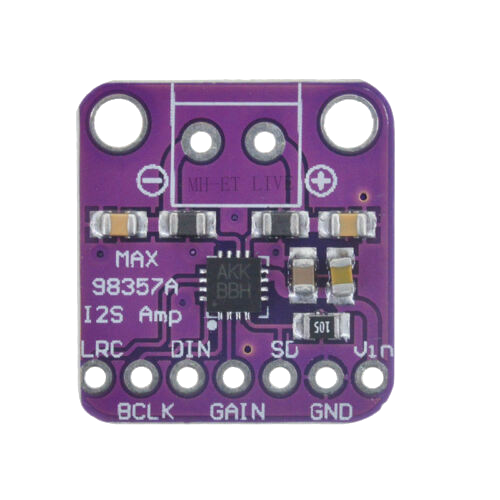

<!-- Improved compatibility of back to top link: See: https://github.com/othneildrew/Best-README-Template/pull/73 -->

<!--
*** Thanks for checking out the Best-README-Template. If you have a suggestion
*** that would make this better, please fork the repo and create a pull request
*** or simply open an issue with the tag "enhancement".
*** Don't forget to give the project a star!
*** Thanks again! Now go create something AMAZING! :D
-->

<!-- PROJECT LOGO -->

<h3 align="center">Smart Doorbell</h3>

  

    A smart Doorbell made with an esp32
     
     
     
    <a href="#about-the-project">View Demo</a>
    ·
    <a href="https://github.com/SkillFlame/Smart-Doorbell/issues/new">Report Bug</a>
    ·
    <a href="https://github.com/SkillFlame/Smart-Doorbell/issues/new">Request Feature</a>
  

<!-- ABOUT THE PROJECT -->
## About The Project

[![Product Name Screen Shot][product-screenshot]]

A simple smart doorbell made with an esp32 that sends a notification through Telegram and plays a custom ringtone

### Built With

* [Arduino Audio Tools](https://github.com/pschatzmann/arduino-audio-tools)
* [push-notifications-arduino-esp8266](https://github.com/witnessmenow/push-notifications-arduino-esp8266)

## Usage 

### Material

* ESP32
* MAX98357
* 4ohm speaker

### HOW TO

1. Wire up a pushbutton on a GPIO22

1. Wire up external DAC

1. Change telegram values

1. Load program to esp32

  1. Please note that you must compile this sketch with the Partition Scheme: Huge App!

### Max98357 external DAC

DAC  |	ESP32
-----|----------------
VDD  |	5V (or 3.3V)
GND  |	GND
LRC  |	WS (GPIO15)
BCLK |	BCK (GPIO18)
DIN  |	DATA (GPIO12)

### Change ringtone

Audacity might help you out here: export the file as RAW signed 16 bit PCM.

Then convert the file with xxd into a C file that contains the data in an array. In the Sketch I am using the MemoryStream class which turns the array into a Stream.

xxd -i ringtone.raw test.c

Please note that you must compile this sketch with the Partition Scheme: Huge App!

<!-- MARKDOWN LINKS & IMAGES -->
<!-- https://www.markdownguide.org/basic-syntax/#reference-style-links -->

[issues-shield]: https://img.shields.io/github/issues/SkillFLame/Smart-Doorbell.svg?style=for-the-badge
[issues-url]: https://github.com/SkillFlame/Smart-Doorbell/issues/new
[product-screenshot]: images/screenshot.png
